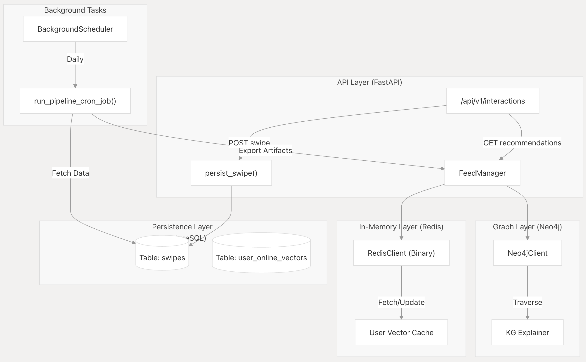
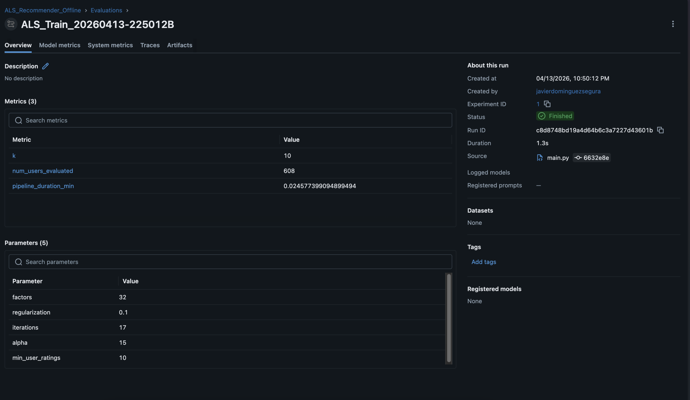
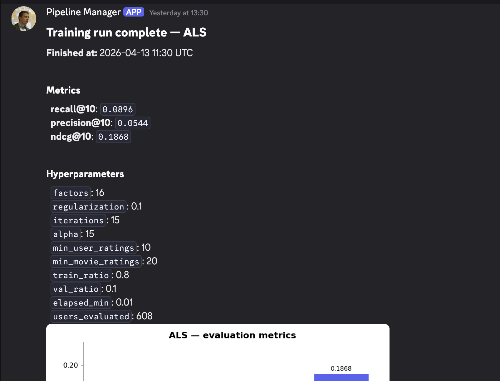
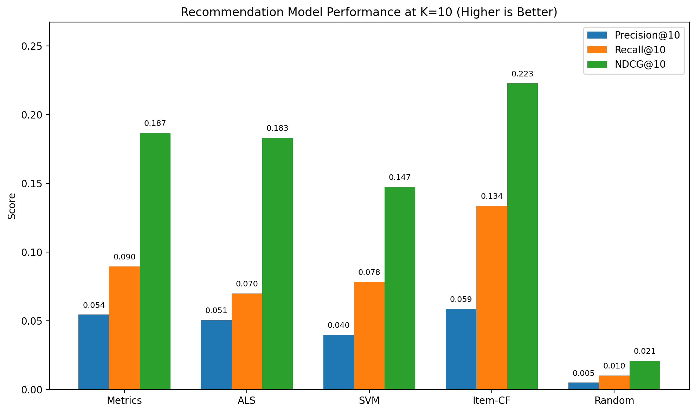
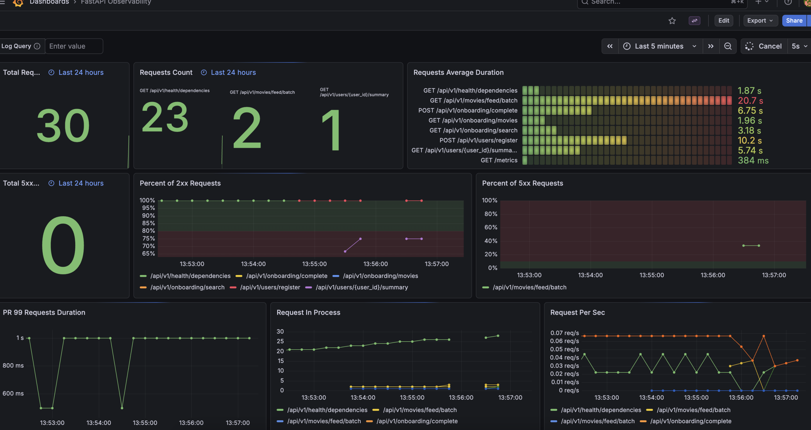
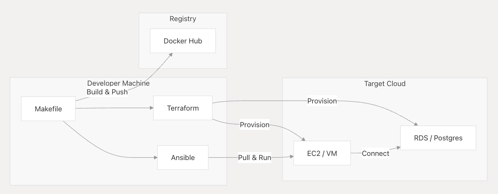

# Arrival — Movie Recommender

> A production-grade movie recommendation platform with a Tinder-style swipe interface, online learning, Knowledge Graph explainability, and a full MLOps stack.

[](https://github.com/Tee-Time-Software-Solutions/arrival-movie-recommender/actions/workflows/ci-backend.yml)
[](https://deepwiki.com/Tee-Time-Software-Solutions/arrival-movie-recommender/1-overview)
\n
[Deployment video](https://drive.google.com/file/d/1ys3i-luG9C5ZmMgwATjpzS12ZjkAFKeN/view?usp=sharing)

---

## What it is

Users swipe through movies (like, dislike, supercharge, skip). Every swipe updates their personal embedding in real time. The recommender (ALS by default, with SVM, BPR, and Item-CF also available) ranks the next batch accordingly.

A Neo4j Knowledge Graph enriches each recommendation with an explanation: "You might like this because you enjoyed films directed by Christopher Nolan."



> Full system documentation: [DeepWiki — Overview](https://deepwiki.com/Tee-Time-Software-Solutions/arrival-movie-recommender/1-overview)

---

## Tech stack

| Layer | Technology |
|---|---|
| Backend | FastAPI, Python 3.11, SQLAlchemy Core, asyncpg |
| Database | PostgreSQL 16 |
| Cache / queues | Redis 7.2 |
| Knowledge Graph | Neo4j 5 |
| Frontend | React 19, TypeScript, Vite, Zustand, Framer Motion, Tailwind CSS v4 |
| Auth | Firebase (Google OAuth + email/password) |
| ML — offline | ALS, BPR, SVM, Item-CF |
| ML — online | Gradient-like user vector updates on every swipe |
| Experiment tracking | MLflow |
| Monitoring | Grafana + Prometheus |
| Notifications | Discord webhook |
| Containerisation | Docker Compose (dev + production) |
| Infrastructure | Terraform (AWS + Azure), Ansible |
| Secrets | Azure Key Vault (Managed Identity), AWS Secrets Manager |
| CI | GitHub Actions (lint → unit tests → integration tests) |
| Package manager | `uv` |

---

## Repository structure

```
├── backend/
│   └── src/movie_recommender/
│       ├── api/v1/                  # FastAPI routers (one per domain)
│       ├── core/                    # Settings, logger, clients
│       ├── database/
│       │   ├── models.py            # SQLAlchemy Core table definitions
│       │   ├── CRUD/                # Async data access (one file per entity)
│       │   └── migrations/          # Alembic
│       ├── dependencies/            # FastAPI Depends() factories
│       ├── schemas/                 # Pydantic I/O + TypedDicts for DB rows
│       └── services/
│           ├── recommender/
│           │   └── pipeline/
│           │       ├── offline/     # ALS, BPR, SVM, Item-CF training pipelines
│           │       └── online/      # Serving: ranker, user_state, feedback
│           ├── knowledge_graph/     # Neo4j schema, beacon, traversal, renderer
│           ├── infra/               # Cloud credential helpers (Azure, AWS)
│           └── notifiers/           # Discord training reports
├── frontend/app/src/
│   ├── app/                         # Page components
│   ├── components/                  # Feature + UI components
│   ├── stores/                      # Zustand stores (auth, movie, chat)
│   └── services/api/               # Axios API layer
├── deployment/
│   ├── docker-compose.yml           # Base compose (shared services)
│   ├── docker-compose.dev.yml       # Dev overrides
│   ├── docker-compose.remote.yml    # Production overrides
│   └── telemetry/
│       ├── prometheus.yml
│       └── grafana/provisioning/    # Dashboards, datasources, alerting (as code)
├── infra/
│   ├── terraform/
│   │   ├── aws/                     # VPC, EC2, RDS, S3
│   │   └── azure/                   # VNet, VM, MySQL, Key Vault
│   ├── ansible/                     # Provisioning playbooks
│   └── scripts/
│       ├── output_redirection/      # Terraform outputs → .env + Ansible inventory
│       └── resource_connections/    # Cloud connection helpers
└── makefile                         # Dev commands
```

> Backend deep-dive: [DeepWiki — Backend Architecture](https://deepwiki.com/Tee-Time-Software-Solutions/arrival-movie-recommender/2-backend-architecture)

---

## ML pipeline

> Full reference: [DeepWiki — Recommendation Engine](https://deepwiki.com/Tee-Time-Software-Solutions/arrival-movie-recommender/3-recommendation-engine)

### Offline training

Four models share the same base preprocessing steps:

```
Preprocess movies → Preprocess ratings → Fetch app swipes (Postgres)
  → Merge interactions → Filter → Prune → Chronological split
    → [ALS]     Build sparse matrix → Train → Evaluate → MLflow + Discord
    → [BPR]     Build LightFM data  → Train → Evaluate
    → [SVM]     Build feature matrix → Train → Evaluate
    → [Item-CF] Build similarity matrix → Train → Evaluate
```

The chronological split ensures no data leakage between train and validation — critical for time-ordered interaction data where future swipes must never inform past training.

**Experiment tracking (MLflow)**

Every **ALS** offline run is logged to MLflow automatically: hyperparameters (factors, regularization, iterations), evaluation metrics, pipeline duration, and model artifacts. The BPR, SVM, and Item-CF pipelines do not integrate MLflow in their `main.py` flows today. This makes ALS runs reproducible and comparable across versions without manual logging.



**Training notifications (Discord)**

On pipeline completion a structured card is posted to a Discord webhook with the full metric summary, hyperparameters, and an evaluation chart. This gives the team visibility into training outcomes without needing to access MLflow directly.



> See [DeepWiki — Offline Training Pipeline](https://deepwiki.com/Tee-Time-Software-Solutions/arrival-movie-recommender/3.1-offline-training-pipeline)

### Benchmarking

Four models evaluated at K=10 on MovieLens 20M with a chronological train/val split:



| Model | Precision@10 | Recall@10 | NDCG@10 |
|---|---|---|---|
| ALS | 0.051 | 0.070 | 0.183 |
| SVM | 0.040 | 0.078 | 0.147 |
| Item-CF | 0.059 | 0.134 | **0.223** |
| BPR | 0.054 | 0.090 | 0.187 |

Item-CF achieves the best NDCG@10. ALS is used as the default online-serving model due to its lower inference latency and native support for incremental user-vector updates.

### Online serving

Every swipe triggers:

1. Load user vector: Redis → Postgres → ALS embedding → cold start (mean of all embeddings)
2. Apply feedback update (`η=0.05`, norm cap 10.0)
3. Persist: Redis (immediate) + Postgres (async background task)
4. On next recommendation request: vectorised dot-product ranking with `argpartition` (O(N) top-k) and seen-movie exclusion

> See [DeepWiki — Online Serving and Real-Time Updates](https://deepwiki.com/Tee-Time-Software-Solutions/arrival-movie-recommender/3.2-online-serving-and-real-time-updates)

### Closed loop

The offline pipeline fetches live swipes from Postgres before every training run. App user IDs are offset by 10,000,000 to avoid collision with MovieLens IDs. Every retrain incorporates real user behaviour alongside the base MovieLens 20M corpus.

---

## Knowledge Graph

> See [DeepWiki — Knowledge Graph](https://deepwiki.com/Tee-Time-Software-Solutions/arrival-movie-recommender/4-knowledge-graph)

Neo4j graph: Movies, Persons (director/actor/writer), Genres, Keywords, Collections, ProductionCompanies.

- **Beacon map** — per-user entity weighting derived from swipe history (entity-type multipliers, Redis-cached 24h)
- **Traversal** — finds highest-scoring path from user interests to recommended movie
- **Renderer** — converts scored path to a human-readable explanation sentence

> Beacon map detail: [DeepWiki — Beacon Map and Explainability](https://deepwiki.com/Tee-Time-Software-Solutions/arrival-movie-recommender/4.2-beacon-map-and-explainability)

---

## Monitoring



Grafana dashboards and alerting rules are provisioned as code (`deployment/telemetry/grafana/provisioning/`). Prometheus scrapes FastAPI metrics. The full observability stack starts with the application via Docker Compose.

> See [DeepWiki — Observability](https://deepwiki.com/Tee-Time-Software-Solutions/arrival-movie-recommender/6.3-observability:-prometheus-grafana-and-mlflow)

---

## Infrastructure



Multi-cloud deployment (AWS + Azure) via Terraform + Ansible:

```
Terraform (AWS or Azure)
  → Provisions VPC/VNet, compute, managed DB, secrets manager
  → terraform output -json
      → infra/scripts/output_redirection/
          → .env files (backend + frontend)
          → Ansible inventory
Ansible
  → Installs Docker on EC2 / Azure VM
  → Deploys production Docker Compose
  → Configures all services
```

Azure deployments use Managed Identity + Key Vault: no credentials in environment files or Docker images. AWS deployments use Secrets Manager.

> See [DeepWiki — Terraform and Cloud Provisioning](https://deepwiki.com/Tee-Time-Software-Solutions/arrival-movie-recommender/6.2-terraform-and-cloud-provisioning)

---

## Setup

> See [DeepWiki — Getting Started](https://deepwiki.com/Tee-Time-Software-Solutions/arrival-movie-recommender/1.1-getting-started)

### Prerequisites

- Docker + Docker Compose
- Python 3.11 (managed by `uv`)
- Node 20+
- Firebase project (for auth)

### 1. Environment variables

> See [DeepWiki — Configuration and Environment Variables](https://deepwiki.com/Tee-Time-Software-Solutions/arrival-movie-recommender/1.2-configuration-and-environment-variables)

```bash
# Backend
cp backend/env_config/base/.env.dev backend/env_config/synced/.env.dev
# Fill in: POSTGRES_URL, REDIS_URL, NEO4J_URI, NEO4J_PASSWORD,
#          FIREBASE_PROJECT_ID, TMDB_API_KEY, DISCORD_WEBHOOK_PIPELINE

# Frontend
cp frontend/app/.env.example frontend/app/.env.local
# Fill in: VITE_BASE_URL, VITE_FIREBASE_API_KEY, ...
```

### 2. Install dependencies

```bash
make install
```

### 3. Start dev environment

```bash
make dev-start
```

| Service | URL |
|---|---|
| App | http://localhost |
| API | http://localhost/api/v1 |
| API docs | http://localhost:8000/docs |
| Grafana | http://localhost:3000 |
| MLflow | http://localhost:5000 |
| Neo4j browser | http://localhost:7474 |

### 4. Run the offline pipeline

```bash
cd backend

# ALS (primary model, MLflow-tracked)
python -m movie_recommender.services.recommender.pipeline.offline.models.als.main

# BPR
python -m movie_recommender.services.recommender.pipeline.offline.models.bpr.main

# SVM
python -m movie_recommender.services.recommender.pipeline.offline.models.svm.main

# Item-CF
python -m movie_recommender.services.recommender.pipeline.offline.models.item_cf.main
```

---

## Development commands

```bash
make install          # Install all dependencies (backend + frontend)
make dev-start        # Start dev environment (Docker Compose)
make dev-rebuild      # Rebuild images and start
make dev-stop         # Stop dev environment
make backend-tests    # Run unit tests
make format-check     # Lint check (ruff)
make gen-dev-token    # Generate Firebase token for local testing
```

### Database migrations

```bash
cd backend
alembic revision --autogenerate -m "description"
alembic upgrade head
```

---

## Testing

> See [DeepWiki — Testing](https://deepwiki.com/Tee-Time-Software-Solutions/arrival-movie-recommender/7-testing) · [Unit Tests](https://deepwiki.com/Tee-Time-Software-Solutions/arrival-movie-recommender/7.1-unit-tests) · [Integration Tests](https://deepwiki.com/Tee-Time-Software-Solutions/arrival-movie-recommender/7.2-integration-tests)

GitHub Actions runs on every push touching `backend/`:

1. **Lint** — `ruff` format check via `uv`
2. **Unit tests** — full test suite
3. **Integration tests** — FeedManager (Redis) + API smoke tests (Postgres)

Pre-commit hooks run on every local commit: trailing whitespace, YAML/JSON validation, large file detection, debug statement detection, `gitleaks` secret scanning, unit tests.

---

## Authentication

> See [DeepWiki — Authentication](https://deepwiki.com/Tee-Time-Software-Solutions/arrival-movie-recommender/2.3-authentication)

Firebase handles identity (Google OAuth + email/password). The backend verifies Firebase ID tokens via a FastAPI dependency (`verify_user()`). Private routes require ownership checks via `user_private_route=True`.

---

## Team

| Name | Role |
|---|---|
| Javier Dominguez Segura | Backend / MLOps / Infrastructure |
| Lucas Van Zyl | Data Engineer |
| Borja Valentin | Data Engineer |
| Lus Infante | ML Engineer |
| Alejandro Helmrich | ML Engineer / Testing |
| Diego Oliveros | Data Scientist |
| Juan Alonso-Allende | Frontend / Chatbot |
| Juliette Janne | Frontend / Project Management |

---

## References

- [TMDB API](https://www.themoviedb.org/documentation/api)
- [MovieLens 20M dataset](https://grouplens.org/datasets/movielens/20m/)
- [implicit (ALS)](https://github.com/benfred/implicit)
- [LightFM (BPR)](https://github.com/lyst/lightfm)
- [MLflow](https://mlflow.org)
- [DeepWiki — Full documentation](https://deepwiki.com/Tee-Time-Software-Solutions/arrival-movie-recommender/1-overview)
- [Glossary](https://deepwiki.com/Tee-Time-Software-Solutions/arrival-movie-recommender/8-glossary)
