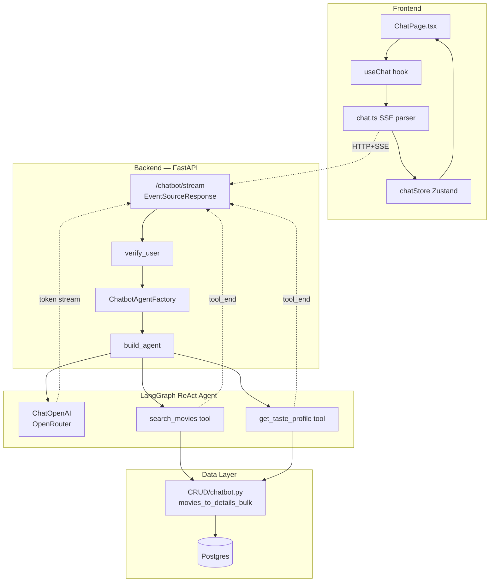
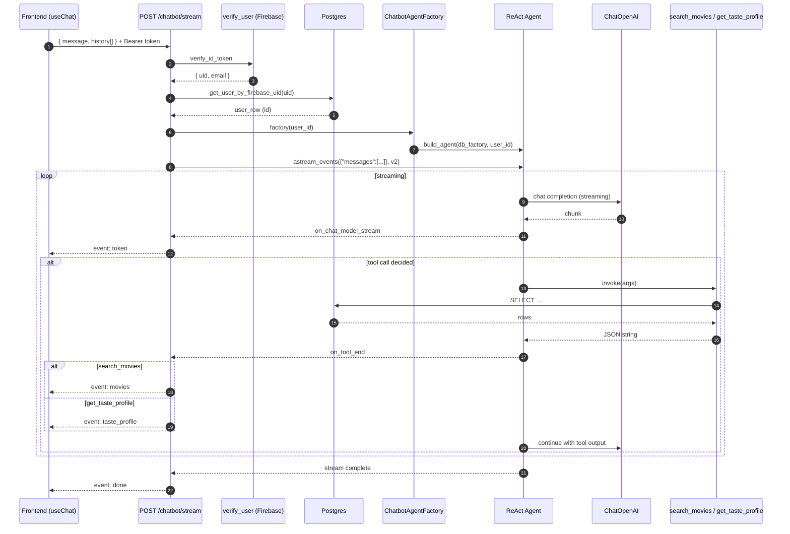
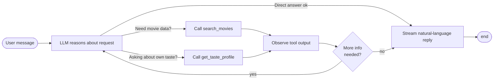
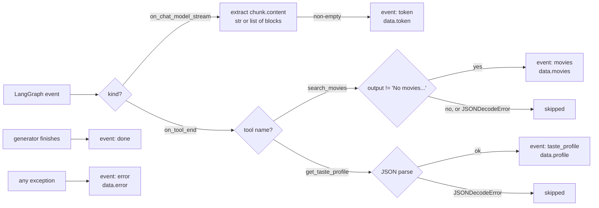

# LangGraph Agent Documentation

The Arrival chatbot is a **LangGraph ReAct agent** named *Arrival*. It answers movie questions, suggests titles, and surfaces the user's own taste profile. This document explains how it is built, every tool it has, how it talks to the rest of the recommendation pipeline, and how to extend it.

> **TL;DR** — One ReAct graph, two read-only tools, one SSE endpoint. The agent currently lives mostly *next to* (not inside) the recommendation pipeline: tools query Postgres directly. Extension points are documented at the bottom.

---

## 1. Overview

| Piece | Where | What |
|---|---|---|
| Graph | [backend/src/movie_recommender/services/chatbot/agent.py](../../backend/src/movie_recommender/services/chatbot/agent.py) | `create_react_agent(llm, tools, prompt=SYSTEM_PROMPT)` |
| Tools | [backend/src/movie_recommender/services/chatbot/tools.py](../../backend/src/movie_recommender/services/chatbot/tools.py) | `search_movies`, `get_taste_profile` |
| LLM | OpenRouter via `langchain_openai.ChatOpenAI` | model from `AppSettings().openrouter.model_name`, `temperature=0.7`, `streaming=True` |
| API endpoint | [backend/src/movie_recommender/api/v1/chatbot.py](../../backend/src/movie_recommender/api/v1/chatbot.py) | `POST /api/v1/chatbot/stream` (SSE) |
| Factory | [backend/src/movie_recommender/dependencies/chatbot.py](../../backend/src/movie_recommender/dependencies/chatbot.py) | `ChatbotAgentFactory(user_id) -> agent` |

### Component map



### Request lifecycle (sequence)



A new agent instance is built **per request** (the factory is cached, but `build_agent()` runs each call). This is intentional: tools are closures over `user_id`, so they cannot be shared across users.

### ReAct decision loop (what the LLM does each turn)



---

## 2. The two tools

Both tools are defined with LangChain's `@tool` decorator and are **read-only** — they never mutate state. Both are produced by *factories* that close over a per-request DB session factory and the authenticated `user_id`.

### 2.1 `search_movies`

**File:** [backend/src/movie_recommender/services/chatbot/tools.py:18-51](../../backend/src/movie_recommender/services/chatbot/tools.py#L18-L51)

**Signature:**

```python
async def search_movies(
    genre_names: list[str] | None = None,
    min_year: int | None = None,
    max_year: int | None = None,
    keyword: str | None = None,
    min_rating: float | None = None,
    limit: int = 8,
) -> str  # JSON-encoded list of MovieDetails (or "No movies found...")
```

| Aspect | Detail |
|---|---|
| Triggered by | System-prompt rule: *"Always use the search_movies tool when users ask for movie recommendations or searches."* |
| CRUD wrapper | `search_movies_by_criteria()` in [database/CRUD/chatbot.py:16-57](../../backend/src/movie_recommender/database/CRUD/chatbot.py#L16-L57) |
| Tables read | `movies`, `genres`, `movies_genres` |
| Hydration | After getting IDs, calls `movies_to_details_bulk()` from [database/CRUD/movies.py](../../backend/src/movie_recommender/database/CRUD/movies.py) so the LLM sees title, year, rating, synopsis, genres, cast, poster URL, providers — the same shape returned by `/movies/feed/batch` |
| Empty result | Returns the literal string `"No movies found matching those criteria."` |
| Surfaces in UI | The API endpoint detects `tool_name == "search_movies"`, parses the JSON, and emits an `event: movies` SSE frame so the frontend can render movie cards inline. |

### 2.2 `get_taste_profile`

**File:** [backend/src/movie_recommender/services/chatbot/tools.py:54-69](../../backend/src/movie_recommender/services/chatbot/tools.py#L54-L69)

**Signature:**

```python
async def get_taste_profile() -> str  # JSON-encoded profile dict
```

| Aspect | Detail |
|---|---|
| Triggered by | System-prompt rule: *"Always use the get_taste_profile tool when users ask about their preferences or viewing patterns."* |
| CRUD wrapper | `get_user_taste_profile()` in [database/CRUD/chatbot.py:60-161](../../backend/src/movie_recommender/database/CRUD/chatbot.py#L60-L161) |
| Tables read | `swipes`, `movies`, `movies_genres`, `genres` |
| Returns | `total_likes`, `total_dislikes`, `genre_counts` (sorted desc), `top_movies` (10 highest-rated likes), `year_range` (min/max), `avg_rating` (of liked movies) |
| Surfaces in UI | Emits `event: taste_profile` SSE frame, but the frontend currently *consumes* it silently — the LLM is expected to summarise the profile in normal text tokens. The event exists so a future UI panel could render it natively. |

### Per-user binding — why factories?

```python
def create_search_movies_tool(db_session_factory, user_id):
    @tool
    async def search_movies(...): ...
    return search_movies
```

The closure captures `user_id` so the LLM never has to pass it. This is a security boundary — the LLM cannot accidentally (or maliciously) request another user's taste profile because the user_id is not part of the tool's argument schema.

---

## 3. Integration with the recommendation pipeline

**Honest current state:** the chatbot tools share **only one** function with the recommender pipeline — `movies_to_details_bulk()` — used to enrich movie IDs into full `MovieDetails`. Otherwise the two tools speak directly to Postgres; they do **not** call:

| Subsystem | Where it lives | Status in chatbot |
|---|---|---|
| Recommender (vector model) | `services/recommender/main.py` | ❌ Not consulted |
| Knowledge Graph beacon (Neo4j) | `services/knowledge_graph/beacon.py` | ❌ Not consulted |
| Feed manager (Redis queue) | `services/recommender/pipeline/feed_manager/main.py` | ❌ Not consulted |
| Movie hydrator (TMDB enrichment) | `services/recommender/pipeline/hydrator/main.py` | ⚠️ Indirect (its outputs are read from Postgres, but the chatbot does not hydrate) |
| Swipe worker | `services/swipe_worker/main.py` | ❌ Not consulted |

This was a deliberate first-cut: it lets the chatbot work even when the recommender is offline or untrained, and keeps tool latency low. The trade-off is that recommendations are **not personalised through the model** — they are filter-based against `tmdb_rating` ordering.

### Extension points (future work)

If you want to deepen integration, four obvious hooks:

1. **Personalised search** — inject a `recommender.score_for_user(user_id, candidate_ids)` call into `search_movies` to re-rank Postgres candidates by the user's embedding.
2. **KG explainability** — add a `why_will_i_like(movie_id)` tool that traverses the Neo4j beacon map (see `services/knowledge_graph/beacon.py`) and explains the recommendation through shared cast/director/genre paths.
3. **Feed-aware suggestions** — read the user's "seen" set from Redis (`seen:user:{user_id}`) so `search_movies` can `EXCLUDE` already-swiped movies.
4. **Online updates** — let the chatbot mutate state too. E.g. an `add_to_watchlist(movie_id)` tool that calls `add_to_watchlist()` from `database/CRUD/watchlist.py`. Today every tool is read-only; mixing in a write tool means widening the system prompt and adding confirmation logic.

---

## 4. SSE event protocol

The endpoint streams **Server-Sent Events** via `sse-starlette`. Each event has an `event:` line and a `data:` line (JSON-encoded payload), separated by a blank line.

| Event | Payload shape | When | Order guarantee |
|---|---|---|---|
| `token` | `{"token": "<text-chunk>"}` | LLM emits a streaming chunk | Many; interleaved with tool events |
| `movies` | `{"movies": [<MovieDetails>, ...]}` | `search_movies` returns a non-empty list | Zero or more times per turn |
| `taste_profile` | `{"profile": {...}}` | `get_taste_profile` completes | Zero or one times per turn |
| `done` | `{}` | Stream end (success) | Always last on success |
| `error` | `{"error": "<message>"}` | Any exception in the generator | Final event on failure (no `done`) |

**Implementation reference:** [api/v1/chatbot.py:52-120](../../backend/src/movie_recommender/api/v1/chatbot.py#L52-L120).

The token chunks are extracted from LangChain's chunk objects, which can be a string or a list of content blocks (`{"type": "text", "text": "..."}`). The endpoint normalises both shapes.

### LangGraph events → SSE events (mapping)



---

## 5. Adding a new tool

Concrete recipe — let's say you want a `who_directed(movie_title)` tool.

### Step 1 — CRUD function

Add an async function in [backend/src/movie_recommender/database/CRUD/chatbot.py](../../backend/src/movie_recommender/database/CRUD/chatbot.py). Use SQLAlchemy Core, return JSON-serialisable types:

```python
async def get_director_by_movie_title(db: AsyncSession, title: str) -> dict | None:
    ...
```

### Step 2 — Tool factory

In [backend/src/movie_recommender/services/chatbot/tools.py](../../backend/src/movie_recommender/services/chatbot/tools.py), add a new factory that mirrors the existing two:

```python
def create_who_directed_tool(db_session_factory: Callable, user_id: int):
    @tool
    async def who_directed(movie_title: str) -> str:
        """Look up the director of a movie by title.

        Use this when the user asks who directed a film.
        """
        async with db_session_factory() as db:
            result = await get_director_by_movie_title(db, movie_title)
            return json.dumps(result, default=str) if result else "Not found."
    return who_directed
```

The **docstring is the LLM's prompt** for when to call this tool — write it carefully. Type-annotate every argument; LangChain derives the tool's JSON schema from the annotations.

### Step 3 — Register in the agent

In [backend/src/movie_recommender/services/chatbot/agent.py:40-43](../../backend/src/movie_recommender/services/chatbot/agent.py#L40-L43):

```python
tools = [
    create_search_movies_tool(db_session_factory, user_id),
    create_taste_profile_tool(db_session_factory, user_id),
    create_who_directed_tool(db_session_factory, user_id),  # ← new
]
```

### Step 4 — Add a system-prompt rule

In `SYSTEM_PROMPT` ([agent.py:14-25](../../backend/src/movie_recommender/services/chatbot/agent.py#L14-L25)) add a bullet:

```
- Always use the who_directed tool when users ask who directed a movie.
```

### Step 5 (optional) — Surface a custom SSE event

If the tool's output should drive UI (like `search_movies` drives the movie cards):

1. Backend — in [api/v1/chatbot.py](../../backend/src/movie_recommender/api/v1/chatbot.py), add an `elif tool_name == "who_directed":` branch in the `on_tool_end` handler that yields `{"event": "director", "data": json.dumps({...})}`.
2. Frontend — in [frontend/app/src/services/api/chat.ts](../../frontend/app/src/services/api/chat.ts), add a matching `case "director":` and a callback in `SSECallbacks`. Then handle the data in [hooks/useChat.ts](../../frontend/app/src/hooks/useChat.ts) → `chatStore`.

If you only need the LLM to *see* the tool output (not the UI), skip step 5 — the tool's text return value is already injected into the LLM context by LangGraph.

### Step 6 — Tests

Add a case to [backend/tests/integration/test_chatbot_stream.py](../../backend/tests/integration/test_chatbot_stream.py) that constructs a fake agent emitting `on_tool_end` for the new tool name and asserts the new SSE event shape.

---

## 6. Caveats & gotchas

- **`lru_cache(maxsize=1)`** on `get_chatbot_agent_factory` ([dependencies/chatbot.py:20-22](../../backend/src/movie_recommender/dependencies/chatbot.py#L20-L22)) caches the *factory*, not the agent. The factory is stateless. The agent itself is **not** cached and is rebuilt on every request — needed because tools close over `user_id`.
- **Do not move the agent build to module level**: doing so would mean every user shares one tool set bound to whatever `user_id` happened to be passed first. That's a privacy bug.
- **No persistent thread/checkpointer.** The agent is stateless across requests. Conversation continuity comes from the frontend re-sending the last 10 messages as `history` (see `MAX_HISTORY` in [hooks/useChat.ts](../../frontend/app/src/hooks/useChat.ts)). If you need server-side memory, add a LangGraph `MemorySaver`/`PostgresSaver` checkpointer.
- **Streaming gotcha**: `agent.astream_events(version="v2")` is the v2 event API. If you upgrade LangGraph, double-check that `on_chat_model_stream` and `on_tool_end` event names still hold.
- **Error swallowing**: malformed JSON tool output is silently dropped (`except json.JSONDecodeError: pass`). Tools should `json.dumps(..., default=str)` so dates/decimals serialise; otherwise no UI event fires.
- **OpenRouter outage**: when the LLM call fails the exception bubbles into `event: error`. The frontend's `useChat` hook then renders the error as the assistant's message content (today; see [api/chatbot.md](api/chatbot.md) for the SSE contract details).
